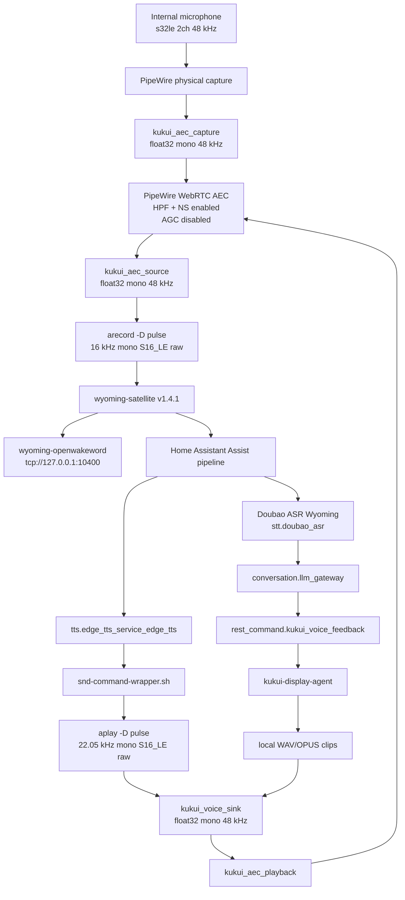

# Voice audio runtime audit: postmarketOS + HA Docker + Wyoming Satellite

Date: 2026-06-20

Scope: wake word, microphone capture, AEC, first-response earcons, TTS
playback, barge-in readiness, and the boundary between postmarketOS, Wyoming
Satellite, Home Assistant, and LLM Gateway.

This document records the current verified runtime state. It replaces the older
static audit that treated AEC and full-duplex support as unproven.

Documentation ownership: the deployed satellite audio/AEC runtime is owned by
`phosh-ha-status`. Keep full environment-variable tables, service ownership, and
target-device repair procedures in that repository. This document is retained as
a Gateway-facing audit snapshot so Voice Harness and trace work have the right
boundary assumptions.

## Current conclusion

The satellite now uses a PipeWire WebRTC AEC graph:

- capture source: `kukui_aec_source`
- voice playback sink: `kukui_voice_sink`
- AEC module: `libpipewire-module-echo-cancel`
- AEC backend: `aec/libspa-aec-webrtc`
- AEC processing format: mono, 48 kHz, float32
- Satellite capture stream: mono, 16 kHz, signed 16-bit PCM
- Satellite TTS stream: mono, 22.05 kHz, signed 16-bit PCM

TTS-time microphone gating has been removed from the maintained satellite
runtime:

- no `--tts-start-command ... set-microphone-mute.sh 1`
- no `--tts-played-command ... set-microphone-mute.sh 0`
- no `KUKUI_TTS_MUTE_GATE` runtime knob

This means the voice stack is no longer intentionally half-duplex during TTS.
The remaining work is measurement: prove false-VAD behavior, residual echo
level, and barge-in quality under real playback.

## Runtime topology



## Verified components

Native compiled audio components on the host:

| Component | Runtime evidence | Role |
|---|---|---|
| PipeWire | `/usr/bin/pipewire`, aarch64 ELF | Audio graph and stream server |
| PipeWire Pulse server | `pipewire-pulse` | Pulse compatibility used by ALSA `pulse` plugin |
| WirePlumber | `/usr/bin/wireplumber`, aarch64 ELF | Session manager |
| ALSA tools | `/usr/bin/aplay`; `arecord` symlink | Raw PCM capture/playback subprocesses |
| PipeWire control | `/usr/bin/wpctl`, aarch64 ELF | Volume/mute control |
| AEC module | `/usr/lib/pipewire-0.3/libpipewire-module-echo-cancel.so` | Echo-cancel graph |
| WebRTC AEC backend | `/usr/lib/spa-0.2/aec/libspa-aec-webrtc.so` | Native AEC/NS processing |

Python/process orchestration:

| Component | Role |
|---|---|
| `wyoming-satellite` | Owns mic/speaker subprocesses and Wyoming protocol |
| `wyoming_openwakeword` | Wake word service |
| `wyoming-doubao-asr` | Wyoming ASR service/client |
| `llm_gateway` | Conversation routing, policy, trace, feedback decisions |

## Formats and conversion points

| Stage | Format |
|---|---|
| Physical microphone source | `s32le 2ch 48000Hz` |
| AEC capture/playback/source graph | `float32le 1ch 48000Hz` |
| Satellite `arecord` stream | `s16le 1ch 16000Hz` raw PCM |
| Satellite `aplay` TTS stream | `s16le 1ch 22050Hz` raw PCM |
| Physical speaker sink | `s32le 2ch 48000Hz` |
| LLM Gateway earcon pack | WAV PCM, `s16le 1ch 16000Hz` |
| `awake.wav`, `processing_loop.wav` | WAV PCM, `s16le 1ch 16000Hz` |
| `done.wav` | WAV PCM, `s16le 1ch 22050Hz` |

The host graph resamples between the satellite subprocess formats and the 48 kHz
PipeWire/AEC graph.

## AEC configuration

Current module arguments:

```text
library.name = aec/libspa-aec-webrtc
audio.rate = 48000
audio.channels = 1
audio.position = [ MONO ]
webrtc.high_pass_filter = true
webrtc.noise_suppression = true
webrtc.gain_control = false
capture.props.node.name = kukui_aec_capture
source.props.node.name = kukui_aec_source
sink.props.node.name = kukui_voice_sink
playback.props.node.name = kukui_aec_playback
```

Current Satellite environment:

```text
KUKUI_MIC_DEVICE=pulse
KUKUI_SND_DEVICE=pulse
PULSE_SOURCE=kukui_aec_source
PULSE_SINK=kukui_voice_sink
```

The Satellite systemd command no longer contains TTS start/played mute hooks.
The old `KUKUI_TTS_MUTE_GATE` environment knob is obsolete and should not be
regenerated.

## Loudness and gain policy

Earcons have deterministic loudness targets:

| Item | Target |
|---|---|
| Earcon integrated loudness | `-24 LUFS` |
| Earcon true-peak ceiling | `-3 dBFS` |
| Earcon file format | 16-bit mono WAV, 16 kHz |

Runtime gain is controlled in the satellite/display layer:

| Signal | Current gain setting |
|---|---|
| TTS day volume | `KUKUI_TTS_VOLUME_DAY=1.0` |
| TTS night volume | `KUKUI_TTS_VOLUME_NIGHT=0.72` |
| Wake cue | `KUKUI_WAKE_CUE_VOLUME=0.85` |
| Processing loop | `KUKUI_PROCESSING_VOLUME=0.58` |
| Fallback clips | `KUKUI_FALLBACK_VOLUME=0.92` |

There is no verified LUFS normalization stage for generated TTS speech. TTS is
played through the sink volume policy above.

## What LLM Gateway owns

LLM Gateway does not process PCM. It owns:

- semantic timing for captured/search/confirmation/failure cues,
- non-blocking first-response scheduling,
- trace fields for feedback and audio graph visibility,
- turn cancellation and stale-result suppression,
- policy that decides whether an earcon/display state is appropriate.

The postmarketOS satellite/display layer owns:

- mic source selection,
- AEC graph selection,
- local playback sink selection,
- playback stop/barge-in mechanics,
- day/night playback gain,
- local failure clips.

## Remaining verification

Current full-duplex status is operationally enabled, but acoustic quality still
needs measured evidence. The maintained acceptance checks are:

```text
aec_enabled=true
aec_reference_active=true
earcon_in_aec_reference=true
tts_in_aec_reference=true
vad_source == asr_source == wake_word_source == kukui_aec_source
mic_open_during_tts=true
false_vad_during_earcon=false
false_vad_during_tts=false
barge_in_detected_during_tts=true
```

Recommended live tests:

1. Play `captured.wav` and `processing_loop.wav` while recording both raw mic
   and `kukui_aec_source`.
2. Measure raw echo RMS, AEC echo RMS, and suppression dB.
3. Run a TTS response while speaking over it and verify wake/VAD/ASR behavior.
4. Verify `rest_command.kukui_voice_barge_in` stops playback and the next turn
   wins the generation race.
5. Record a short stereo physical mic sample to determine whether the hardware
   exposes useful independent dual-mic channels before considering beamforming.

## Risks

- WebRTC AEC may need convergence time; short clips can still leak into ASR.
- AGC is disabled; capture level depends on mic gain and Satellite multiplier.
- Local clips not routed through `kukui_voice_sink` would bypass the AEC
  reference. Keep all voice playback on the Pulse sink with
  `PULSE_SINK=kukui_voice_sink`.
- Remote HA `media_player` playback cannot be cancelled by the local AEC graph
  unless mirrored into the local reference sink.
- Future regeneration of satellite service/env files must preserve removal of
  TTS mute hooks and must not reintroduce `KUKUI_TTS_MUTE_GATE`.

## Useful runtime probes

```bash
systemctl --user --no-pager --full status wyoming-satellite.service
tr '\0' '\n' < /proc/$(systemctl --user show -p MainPID --value wyoming-satellite.service)/environ
pactl list short modules | grep -Ei 'echo|aec'
pactl list sources
pactl list sinks
pactl list source-outputs
pactl list sink-inputs
wpctl status
```
