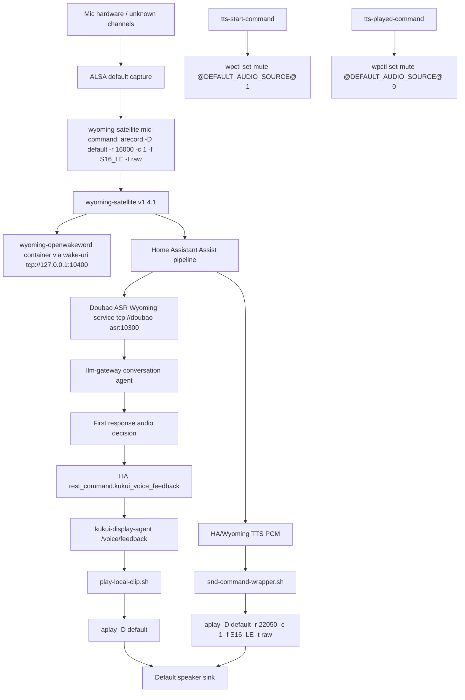
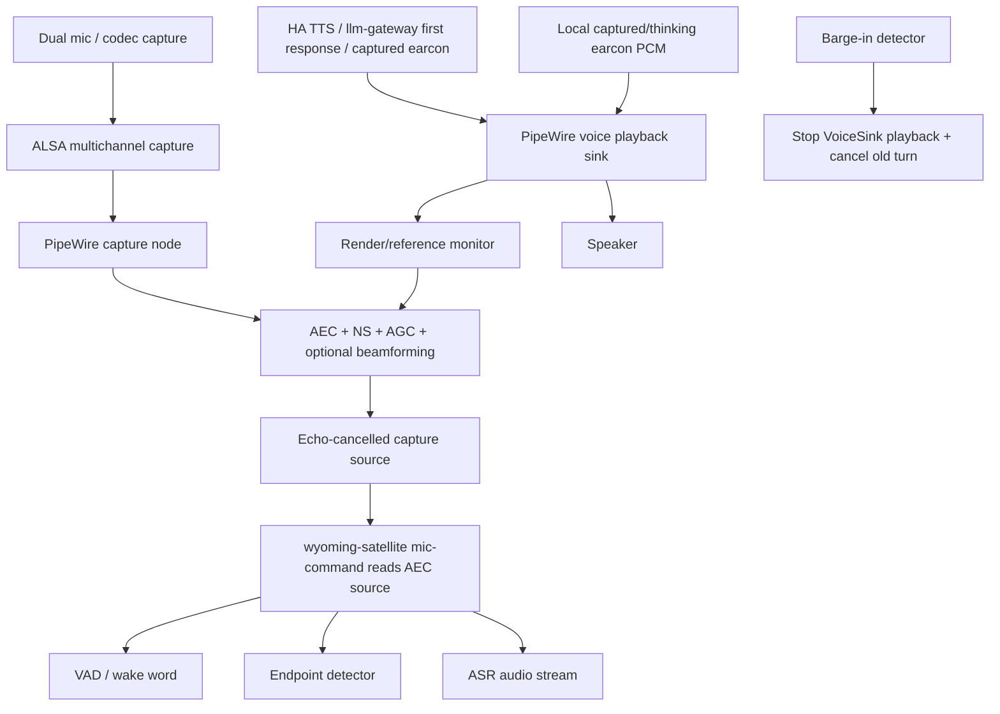

# Voice Audio Audit: postmarketOS + HA Docker + Wyoming Satellite

Date: 2026-06-20

Scope: captured earcon, first response audio, TTS playback, VAD/endpoint/ASR,
barge-in, AEC, and the Home Assistant / Docker / postmarketOS boundary.

Remote host probing was not executed in this first pass because SSH credentials
were not available through environment variables in the local agent process.
The analysis below is based on local repositories under `/Users/driezy/Downloads`
and prior deployed repository documentation. It deliberately does not claim AEC
or full-duplex capability without runtime evidence.

## Executive Summary

- Dual microphone support: unknown from live hardware. Current deployed
  satellite config records mono with `arecord -D default -r 16000 -c 1`, so the
  voice path is currently mono even if the hardware has two microphones.
- AEC support: not proven. The code/config evidence shows PipeWire is present,
  but no configured echo-cancel source, render/reference sink, or WebRTC AEC
  path is proven.
- Captured earcon while listening: current `llm-gateway` metadata marks
  `captured.can_play_while_listening=true`, but the satellite stack currently
  protects against self-capture mostly through microphone mute/gates, not proven
  AEC full-duplex.
- TTS/earcon barge-in: partial. `phosh-ha-status` exposes
  `/voice/playback/stop` and `/voice/barge-in`, and `stop-playback.sh` kills
  `aplay`/clip/processing-loop processes. But TTS start currently mutes the
  default capture source, so natural speech-over-playback remains degraded until
  AEC capture is wired.
- Maximum risk: Docker/HA/ASR traces can imply full-duplex at the UX level while
  the host audio graph is still half-duplex/gated. This can cause false VAD/ASR,
  missed barge-in, or over-aggressive microphone mute.

Bottom line: today this should be treated as `full_duplex_mode=degraded` unless
runtime probing proves an active echo-cancelled capture source and an active
render reference containing captured earcon/TTS PCM. The target is not to keep
it degraded; the target is to migrate the host audio graph so full-duplex is
real and measurable.

## Current Audio Topology

Observed from local code/config:



Verified from repository code:

- Satellite mic source:
  `phosh-ha-status/satellite/wyoming-satellite.service`
  uses `--mic-command "arecord -q -D default -r 16000 -c 1 -f S16_LE -t raw"`.
- Satellite TTS output:
  `phosh-ha-status/satellite/snd-command-wrapper.sh`
  invokes `aplay -q -D "$SND_DEVICE" -r "$SND_RATE" -c 1 -f S16_LE -t raw`.
- First-response local adapter:
  `llm-gateway/custom_components/llm_gateway/first_response_audio.py`
  prefers `rest_command.kukui_voice_feedback`.
- HA package:
  `phosh-ha-status/home-assistant/packages/kukui_display.yaml`
  routes `rest_command.kukui_voice_feedback` to
  `http://127.0.0.1:10710/voice/feedback`.
- Local clips:
  `phosh-ha-status/satellite/play-local-clip.sh` plays OPUS/WAV through
  `aplay -D default`.
- Existing gate:
  `phosh-ha-status/satellite/set-microphone-mute.sh` calls
  `wpctl set-mute @DEFAULT_AUDIO_SOURCE@`.

Unknown until remote probing:

- Whether `default` capture is raw ALSA, PipeWire ALSA plugin, or an
  echo-cancelled virtual source.
- Whether `default` playback is a PipeWire sink that can be used as AEC render
  reference.
- Whether there is any active PipeWire/PulseAudio/WebRTC/hardware AEC.

## Target Audio Topology

The natural full-duplex target should be:



Hard requirement for claiming `full_duplex_mode=full`:

```text
aec_enabled=true
aec_reference_active=true
earcon_in_aec_reference=true
tts_in_aec_reference=true
vad_source == asr_source == endpoint_source == echo-cancelled capture source
mic_open_during_earcon=true
false_vad_during_earcon=false
```

## postmarketOS Native Audio Stack

Local repo evidence shows the deployed services expect PipeWire/WirePlumber:

- `wyoming-satellite.service` has
  `After=network-online.target pipewire.service wireplumber.service`.
- Capture mute/unmute uses `wpctl`, not ALSA mixer directly.
- Playback scripts set volume via `wpctl set-volume @DEFAULT_AUDIO_SINK@`.

Live facts still required:

- `aplay -l`, `arecord -l`, `arecord -L`.
- `wpctl status`, `pw-dump`, `pw-top`.
- `pactl list sources/sinks/source-outputs/sink-inputs`.
- Whether an echo-cancel source/sink exists.
- Whether any PipeWire filter-chain or PulseAudio `module-echo-cancel` is
  loaded.

## Dual Microphone Analysis

No live audio sample was captured in this pass.

Current satellite config forces mono:

```text
arecord -q -D default -r 16000 -c 1 -f S16_LE -t raw
```

Implications:

- Even if hardware exposes stereo/dual mic, the deployed wake/VAD/ASR path
  discards channel independence.
- Beamforming cannot be used in the current satellite path.
- Dual mic feasibility requires live `arecord -L` and stereo sample correlation
  testing.

Required verification:

1. Record `default` mono and stereo.
2. Record each hardware capture PCM listed by `arecord -L`.
3. Compute per-channel RMS/peak/correlation.
4. If stereo channels are highly correlated or one channel is silent, treat
   dual mic as unavailable for beamforming.

## AEC / Audio Processing Analysis

Current evidence points to microphone gating, not AEC:

- Wake cue has a native gate:
  `--mic-seconds-to-mute-after-awake-wav 0.08`.
- TTS mutes capture:
  `--tts-start-command "%h/wyoming_satellite/set-microphone-mute.sh 1"`.
- TTS restores capture:
  `--tts-played-command "%h/wyoming_satellite/set-microphone-mute.sh 0"`.
- Error clips explicitly mute around playback in
  `satellite/voice-error.sh`.

This is robust against self-capture, but it is not natural full-duplex:

- User speech during mute can be missed.
- Barge-in during TTS is only possible if a separate wake/barge-in path remains
  open or if mute is removed after AEC is introduced.
- No evidence yet that playback PCM is fed to an AEC render/reference input.

Recommended AEC migration:

1. Create a dedicated PipeWire voice playback sink.
2. Route all earcon/TTS/local clip playback to that sink.
3. Feed that sink monitor into an AEC/filter-chain node as render reference.
4. Expose an echo-cancelled capture source.
5. Change satellite `--mic-command` from raw/default capture to the
   echo-cancelled source.
6. Remove TTS/captured-earcon capture mute only after false-VAD/ASR tests pass.

## Playback Path Analysis

### Captured earcon

In `llm-gateway`, captured earcon is a trace/policy event:

- `feedback.py` defines `captured.duration_ms=148`.
- `captured.can_play_while_listening=true`.
- It is not proof of AEC.

Actual playback depends on the external display/satellite agent. For the local
adapter path, fixed clips are played by the display agent through
`play-local-clip.sh`, eventually `aplay -D default`.

If `aplay -D default` goes to a normal speaker sink but no AEC render reference
is configured, then:

```text
aec_reference_available=false
earcon_in_aec_reference=false
full_duplex_mode=degraded
```

### First response audio

`llm-gateway` route order:

1. local service candidates, with `rest_command.kukui_voice_feedback` first;
2. HA TTS/media_player fallback if configured.

`first_response_audio.py` schedules playback as an async task so it should not
block route decision or local live context. This was already covered by trace
critical-path tests.

### TTS

Wyoming satellite TTS playback goes through `snd-command-wrapper.sh` and
`aplay -D default`.

The wrapper posts playback events, sets volume, and plays PCM. Current TTS
start/played commands mute/unmute capture, which protects ASR but blocks natural
barge-in unless a separate always-open AEC/barge-in path exists.

### HA media_player

If first response/TTS is played by HA `media_player` on a remote device, the
postmarketOS host AEC cannot use that PCM as render reference unless the same
PCM is also mirrored into the local AEC reference. Such playback must be marked:

```text
aec_reference_available=false
full_duplex_mode=degraded
```

## Docker / Satellite Boundary

Observed architecture:

- `doubao-asr-for-ha` is a Wyoming ASR server. It does not open microphones or
  speakers; it receives Wyoming `AudioChunk` events and converts them to 16 kHz
  mono PCM.
- The satellite service on postmarketOS owns capture and playback commands.
- Wake word runs through a `wakeword` Docker container, reached by the
  satellite over TCP.

Important boundary:

- The ASR Docker container is not the right place to solve AEC.
- AEC belongs on the postmarketOS host audio graph before satellite streams
  audio to HA/ASR.
- Containers should receive already processed echo-cancelled audio, not raw
  `/dev/snd`, unless the container itself owns PipeWire and AEC.

## HA Core Input/Output Flow

Most likely current data flow:

```text
postmarketOS satellite:
  arecord default mono raw
  → wyoming-satellite
  → HA Assist pipeline
  → Doubao ASR Wyoming
  → llm-gateway conversation
  → HA TTS / display-agent rest_command
  → local aplay default / media_player
```

Best target data flow:

```text
postmarketOS host:
  ALSA dual mic
  → PipeWire capture
  → AEC/NS/AGC/beamforming
  → echo-cancelled source
  → wyoming-satellite
  → HA Assist pipeline

Playback:
  llm-gateway semantic cue / HA TTS / local clips
  → single voice playback sink
  → speaker
  → AEC render reference
```

## Full-duplex Listening / Barge-in Feasibility

Current feasibility:

- Captured earcon while listening: degraded/unknown. The cue is short enough
  and marked listening-safe, but AEC reference is not proven.
- TTS while listening: not currently natural full-duplex because TTS playback
  mutes capture.
- Barge-in: playback stop API exists. Natural detection while TTS is playing
  requires open echo-cancelled capture.

Migration strategy:

1. Keep existing mute gates as safety fallback.
2. Add trace fields proving audio graph state.
3. Add a diagnostic command that plays captured earcon while recording raw and
   AEC streams.
4. Introduce PipeWire AEC source/sink.
5. Switch satellite mic-command to AEC source.
6. Route all local clips and TTS to the AEC reference sink.
7. Reduce mute gates to short ignore windows.
8. Finally enable true barge-in/full-duplex by policy.

## Resource Usage

No live `top`, `docker stats`, or `pw-top` data was collected in this pass.

Expected cost:

- WebRTC AEC + NS + AGC is usually feasible on a modern ARM tablet, but must be
  measured under wakeword + ASR + TTS load.
- Beamforming or heavy neural denoise may be too expensive unless the codec/DSP
  provides hardware help.

## Recommended Target Architecture

```text
postmarketOS host:
  ALSA / codec / dual mic
    ↓
  PipeWire / WirePlumber
    ↓
  AEC / NS / AGC / optional beamforming
    ↓
  echo-cancelled capture source
    ↓
  Docker satellite / voice gateway
    ↓
  HA Core Assist pipeline

Playback:
  HA TTS / local earcon / first response
    ↓
  controlled PipeWire playback sink
    ├─→ speaker
    └─→ AEC render reference
```

## Minimal Change Plan

1. Trace only.
   - Add `audio_graph`, `earcon_diagnostics`, `aec_diagnostics`, and critical
     path playback flags.
   - Default to degraded unless AEC evidence is supplied.
2. Diagnostic command.
   - Add a local script or display-agent endpoint that plays captured earcon
     while recording raw and AEC sources to `/tmp`.
   - Report false VAD and ASR partials.
3. PipeWire graph.
   - Add a proposed WirePlumber/PipeWire config for a voice playback sink and
     echo-cancel source.
   - Do not deploy until tested.
4. Satellite input.
   - Change `--mic-command` to read the echo-cancelled source.
5. Playback unification.
   - Change `snd-command-wrapper.sh`, `play-local-clip.sh`, and processing loop
     to use the dedicated voice playback sink.
6. Policy.
   - If AEC reference is active: allow captured earcon while listening.
   - If not: short non-verbal cue only, ignore window/VAD threshold bump, no
     full-duplex claim.

## Risks

- AEC reference not available for `rest_command`/media_player playback.
- Docker or satellite bypasses host audio processing.
- Dual mic is mixed down to mono before userspace.
- PipeWire auto-suspend adds first-frame latency or breaks AEC convergence.
- Captured earcon triggers VAD if played into raw mic.
- User speech during TTS mute is missed.
- first-response audio accidentally joins the critical path.
- Secrets leak through SSH command lines or reports if not handled via env.

## Concrete Next Tasks

### llm-gateway trace schema

- File: `custom_components/llm_gateway/traces.py`
- Change: persist `audio_graph`, `earcon_diagnostics`, `aec_diagnostics`,
  `critical_path_flags`.
- Test: `tests/test_traces.py`.
- Acceptance: traces explicitly show whether AEC source/reference are active
  and whether feedback playback joined the critical path.

### Voice Harness panel

- File: `custom_components/llm_gateway/frontend/voice-harness-panel.js`
- Change: add an Audio Graph panel rendering `audio_graph`,
  `earcon_diagnostics`, and `aec_diagnostics`.
- Test: panel fixture / `bun run typecheck` / `bun run build:panel`.
- Acceptance: operator can see `full_duplex_mode=full|degraded|disabled` without
  opening raw JSON.

### phosh-ha-status diagnostic endpoint

- File: `phosh-ha-status/agent/kukui_display_agent.py`
- Change: add a non-persistent `/voice/audio-diagnostics` command that records
  short raw/AEC clips in `/tmp`, plays captured earcon, and returns metrics.
- Test: unit test with mocked subprocesses.
- Acceptance: no config writes, no service restarts, reports false-VAD/ASR
  observation fields.

### PipeWire AEC proposal

- File: new doc or sample config in `phosh-ha-status/docs/`.
- Change: propose a voice playback sink + echo-cancel capture source.
- Test: manual target test only.
- Acceptance: `wpctl status` shows a stable AEC source and voice playback sink.

### Satellite AEC migration

- File: `phosh-ha-status/satellite/wyoming-satellite.service`
- Change: after AEC is verified, switch `--mic-command` to the echo-cancelled
  capture source and route playback scripts to the voice sink.
- Test: captured earcon no false VAD; user speech within 100 ms still detected;
  TTS barge-in works.
- Acceptance: `full_duplex_mode=full` is backed by trace evidence.

## Proposed Trace Schema

```json
{
  "audio_graph": {
    "raw_mic_source": "",
    "aec_mic_source": "",
    "vad_source": "",
    "endpoint_source": "",
    "asr_source": "",
    "wake_word_source": "",
    "playback_sink": "",
    "render_reference_source": "",
    "aec_enabled": false,
    "aec_reference_active": false,
    "earcon_in_aec_reference": false,
    "tts_in_aec_reference": false,
    "container_bypasses_host_audio_processing": null
  },
  "earcon_diagnostics": {
    "earcon_name": "",
    "can_play_while_listening": true,
    "mic_open_during_earcon": true,
    "vad_threshold_profile": "",
    "ignore_window_ms": 0,
    "false_vad_during_earcon": false,
    "asr_partial_during_earcon": "",
    "full_duplex_mode": "full|degraded|disabled"
  },
  "aec_diagnostics": {
    "raw_echo_rms": null,
    "aec_echo_rms": null,
    "echo_suppression_db": null,
    "double_talk_detected": null,
    "residual_echo_likelihood": null
  },
  "critical_path": {
    "feedback_blocking_critical_path": false,
    "audio_playback_joined_critical_path": false
  }
}
```

## Answers to Acceptance Questions

1. postmarketOS dual mic usable? Unknown until live `arecord` tests.
2. Dual mic independent channels? Unknown; current satellite forces mono.
3. AEC exists? Not proven.
4. AEC type? Unknown; no live PipeWire/PulseAudio evidence yet.
5. Captured earcon in AEC reference? Not proven; treat as false until verified.
6. TTS in AEC reference? Not proven; current TTS mutes capture.
7. VAD/endpoint/ASR raw or echo-cancelled? Most likely raw/default mono unless
   `default` maps to an AEC source; needs live verification.
8. Docker satellite bypasses host processing? Satellite is host user service,
   but ASR/wake containers consume satellite audio over Wyoming/TCP. Host
   processing depends on what `arecord -D default` reads.
9. Mic open during captured earcon? Unknown for captured earcon; wake/TTS/error
   paths show explicit mute gates.
10. Captured earcon false VAD/ASR? Unknown until audio experiment.
11. User speech during captured earcon recognized? Unknown until test.
12. first_response_audio/captured earcon blocking critical path? Code intends
   non-blocking; trace now should expose explicit flags.
13. Safe to enable full-duplex today? Not yet. Safe mode is degraded.
14. Minimal repair path? Trace → diagnostic hook → PipeWire AEC graph → switch
   satellite to AEC source → route all playback to reference sink → remove long
   mute gates.
15. Responsibility split:
   - postmarketOS host: ALSA/PipeWire/AEC/NS/AGC/playback reference.
   - satellite/display agent: mic source selection, local clips, playback stop,
     barge-in hooks, diagnostics.
   - HA Core/llm-gateway: semantic cue timing, trace, turn cancellation,
     capability routing.
   - ASR container: transcription only, not AEC.

